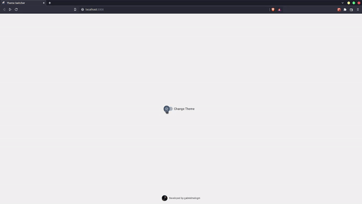

<div align="center">
  <h1>Theme Switcher</h1>

</div>
This is a simple application build with react. My main focus was to study the concept of state in react, which proved to be a powerful tool in many situations.

## 👇🏽 How to run
- Clone this repository
- Install the dependencies:
```bash
#with yarn
yarn

#with npm
npm install
```
- How to run development server run:
```bash
#with yarn
yarn dev

#with npm
npm run dev
```

## ⚙️ Tools
- Next
- Material UI
